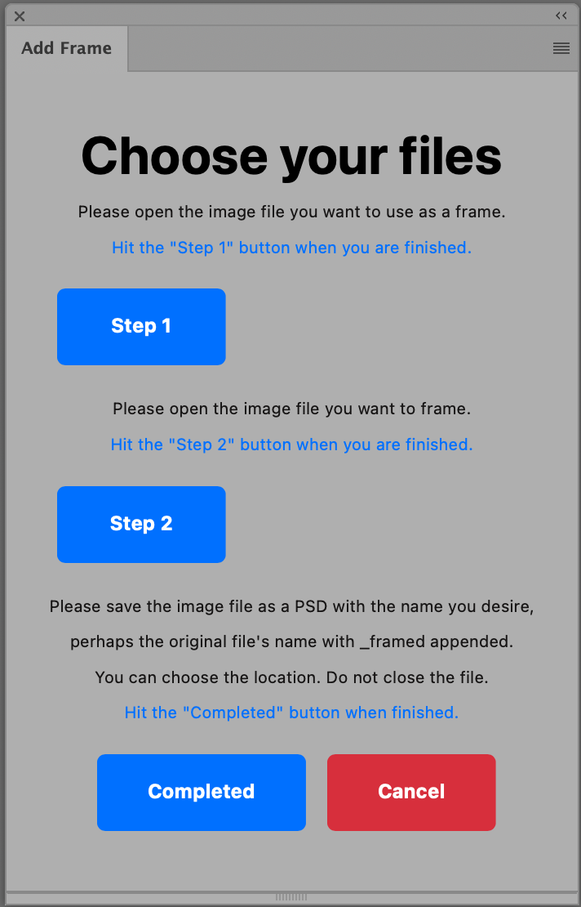
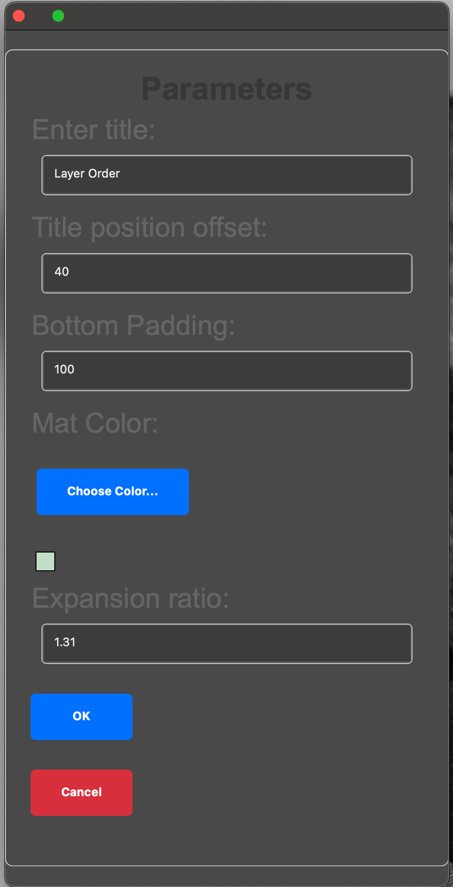
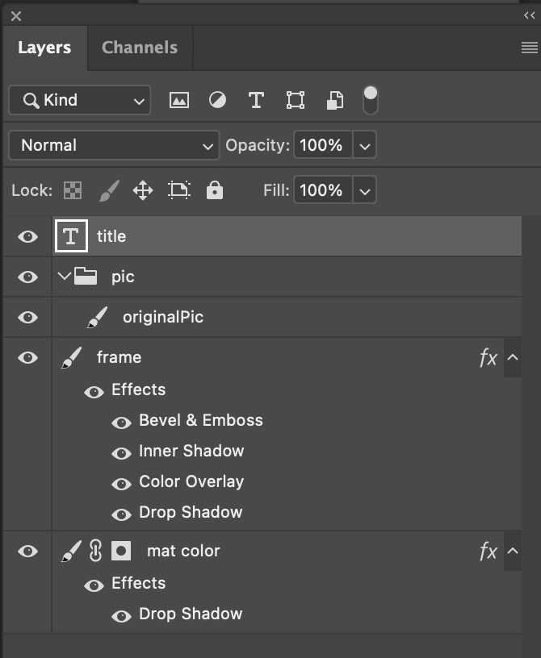

# frame_ps_plugin
Automated generation of a virtual frame for an image

This project is designed to add virtual frames to an image in Photoshop.

### Some of the features:
* Works with arbitrary aspect ratios
* Adds text field for the title
* Adds a mat with a user chosen color

## Installation:
  This is a photoshop plug-in and you need the ccx file.
  This will be updated as I profress

## Useage:
    After installation you got to Plugins>Add Frame>Add Frame

## Setting the items:
  You will be presented with this panel  
  
   
1. Choose the frame file and make it active.
2. Press "Step 1" button.
3. Note that any layer effects on the frame will be disabled. This may change the appearance of the frame. Don't worry. They will be re-enabled after processing.
3. Open the image you want to frame
4. Press "Step 2" button
5. Press the "Process" button
6. Press the "Clear" button if you want to change files.

## Setting the parameters:
  You will be presented with this panel  
  
   
1. Choose the title of your image. It may be blank.
2. The title offset position moves the title up or down. 40 is a good starting point
3. Bottom padding moves the image file up or down within the mat. 100 is a good starting point if you have a title. 0 will leave it centered vertically
4. Choose Color opens a color picker to choose the color of the mat
5. Expansion ratio determines the width of the mat. If you choose 1, you will have no mat and the frame will crop your imagae. 1.31 is a good starting point.
6. Choose OK to process the image, Cancel to return to the main panel

## Working with the included Frame
Although you can certainly use your own frames, the included one is pretty flexible. It uses layer styles and you can change the frame color but still keep the grain by modifying the Color Overlay. You can do this on the original frame file or on the image generated by the script. 

## Post Processing
The generated file will have the following layers:

1. title: a text layer.
2. frame: the frame.
3. pic: A Layer group which contains your original image. If the original image had a background layer it will be renamed originalPic
4. mat color: filed with the color you chose.

You can alter these layers as you like. Changing the font, size and location of the title, the color of the mat, etc. You can also change the frame color by editing the layer properties of "frame".
